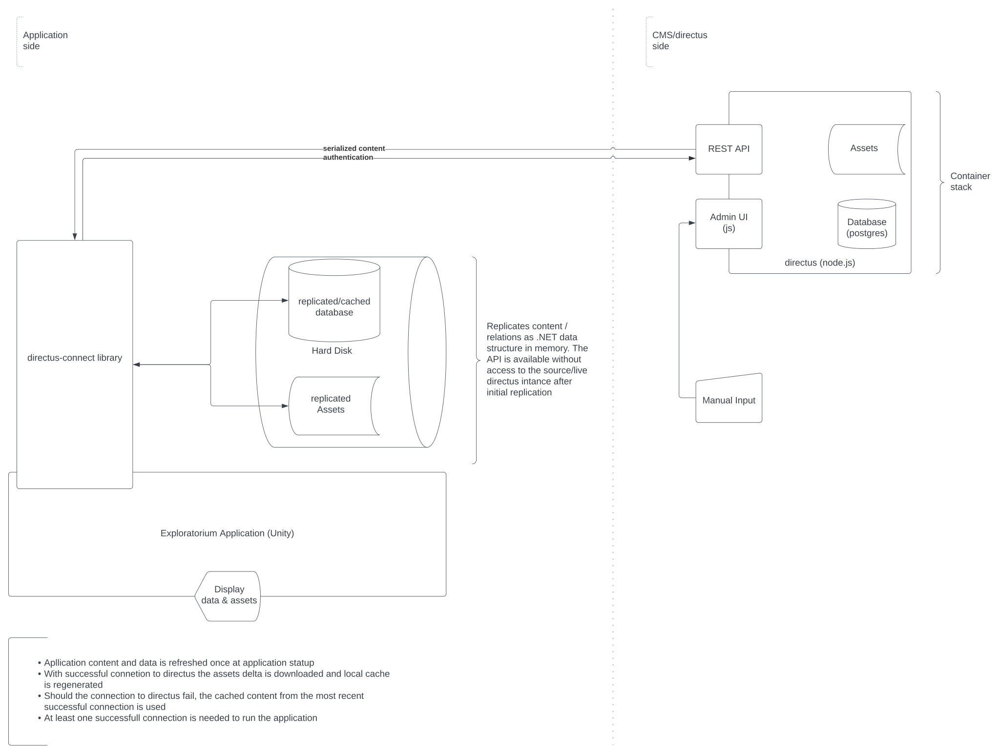

# Exploratorium

## Name der Anwendung

Senckenberg Museum für Naturkunde Görlitz - Exploratorium

## Inhaltsverzeichnis

- [Exploratorium](#exploratorium)
  - [Name der Anwendung](#name-der-anwendung)
  - [Inhaltsverzeichnis](#inhaltsverzeichnis)
  - [Kurzbeschreibung](#kurzbeschreibung)
  - [Installation](#installation)
    - [Installation Viewer-App](#installation-viewer-app)
    - [Installation Content-Management-System](#installation-content-management-system)
  - [Benutzung](#benutzung)
    - [Benutzung Content-Management-System](#benutzung-content-management-system)
    - [Benutzung Viewer-App](#benutzung-viewer-app)
      - [Für Ausstellungsbesucher](#für-ausstellungsbesucher)
      - [Für Ausstellungsmoderatoren](#für-ausstellungsmoderatoren)
        - [Moderator Modus Aktivieren](#moderator-modus-aktivieren)
      - [Für Administratoren](#für-administratoren)
      - [Systemvoraussetzungen - Viewer-App](#systemvoraussetzungen---viewer-app)
      - [Systemvoraussetzungen - Content-Management-System](#systemvoraussetzungen---content-management-system)
    - [Netzwerk / Betriebskonzept](#netzwerk--betriebskonzept)
  - [Beteiligung](#beteiligung)
  - [Credits](#credits)
    - [Auftraggeber](#auftraggeber)
    - [Autor und Rechteinhaber](#autor-und-rechteinhaber)
  - [Lizenz](#lizenz)
    - [Proprietäre Drittanbieter Software](#proprietäre-drittanbieter-software)
    - [Drittanbieter Lizenzen](#drittanbieter-lizenzen)
  - [Förderungen](#förderungen)

## Kurzbeschreibung

"Exploratorium" ist ein Multimediasystem des Senckenberg Museum Görlitz bestehend aus einem physischen, freistehenden Regal in das fünf Bildschirme eingelassen sind. Vier dieser Bildschirme dienen als interaktive Terminals (Stationen). An diesen Stationen können Besucher eigenständig und unabhängig voneinander audiovisuelle Medieninhalte (Bilder, Videos und 3D Modelle) zu den Themen Sammeln, Dokumentieren, Präparieren, Archivieren und Forschen entdecken und betrachten. Die Installation versucht dabei dem Besucher einen Überblick und breitgefächertes Verständnis für die Arbeit mit einer wissenschaftlichen Sammlung in all ihren Aspekten zu vermitteln. Zusätzlich zum individuellen Erkunden der Inhalte kann das Multimediasystem in einem moderierten Modus betrieben werden mit dem alle Stationen synchronisiert werden um die Inhalte z.B. im Rahmen einer Führung zu präsentieren.

Dieses Multimediasystem ist entstanden im Verbundprojekt _museum4punkt0 – Digitale Strategien für das Museum der Zukunft_, Teilprojekt "Exploratorium". Das Projekt museum4punkt0 wird gefördert durch die Beauftragte der Bundesregierung für Kultur und Medien aufgrund eines Beschlusses des Deutschen Bundestages. [Weitere Informationen](https://www.museum4punkt0.de)

## Installation


Die Software des Multimediasystems besteht aus zwei Teilen:

- Eine Windows 10 basierte Desktop Applikation, der [__Viewer-App__](viewer/), zur Präsentation und zum interaktiven Erkunden von Medieninhalten
- Eine Docker/OCI/Linux basierte REST API, WebApp und Datenbank, dem [__Content-Management-System__](directus-container/) (CMS), zur Verwaltung aller Inhalte und zur Konfiguration angeschlossener Viewer-App.

**Wichtiger Hinweis:** Aus rechtlichen Gründen können keine Medieninhalte in diesem Repository vorgehalten werden und eine Installation wie fortfolgend beschrieben ist ohne diese nicht lauffähig. Bei dem Source-Code der Viewer-App im Verzeichnis [viewer](viewer/) handelt es sich um eine reduzierte Version.

### Installation Viewer-App

1. Unter Releases die neueste Version des Viewers als .zip herunterladen
2. Das .zip in einen beliebigen Ordner entpacken
3. Im gewählten Ordner die Datei `Exploratorium.exe` ausführen.
4. Während "Autostart Pending" angezeigt wird 3x in schneller Folge die Taste `F2` drücken um das Settings-Menü aufzurufen
5. Es erscheint ein Button "Cancel Autostart", auf diesen Klicken bevor der Timer abgelaufen ist
6. Im nun sichtbaren Menü die Verbindungsdaten zum CMS eintragen
7. Die Autostart-Konfiguration nach Wunsch anpassen
8. Auf "Save Profile" klicken (die aktuellen Einstellungen sind nun gespeichert und werden beim nächsten Start automatisch angewendet)
9. Die Viewer-App mit Alt+F4 beenden und wie in (3) neu starten.
10. Die Viewer-App startet nun automatich mit den gespeicherten Einstellungen und beginnt die Inhalte des CMS vorzuladen und lokal zu speichern (Caching). Je nach Umfang der Inhalte im CMS und Geschwindigkeit der Netzwerkverbindung zum CMS kann dieses erste Caching sehr lange dauern. Der Fortschritt kann im Settings-Menü (3x `F2`) beobachtet werden.
11. Falls das Caching fehlschlägt kann die Viewer-App neu gestartet werden um das Caching an der letzten Position fortzusetzen
12. Wenn alle Inhalte geladen wurden startet die Viewer-App in den konfigurierten Modus. Je nach Konfiguration müssen ggf. andere Instanzen der Viewer-App parallel gestartet werden (mehr dazu [hier](#für-ausstellungsmoderatoren) und [hier](#für-administratoren))


### Installation Content-Management-System

Die Container Deklaration welche das gesamte CMS beschreibt befindet sich als Docker Compose-File im Order [directus-container](directus-container).
Bitte bachten Sie die gesonderte [Dokumentation](directus-container/README.md).

## Benutzung

### Benutzung Content-Management-System

Die Benutzung des Content-Management-Systems ist im [Handbuch](assets/exploratorium-cms-manual.pdf) ausführlich beschrieben.

### Benutzung Viewer-App

Die Benutzung der Viewer-App unterscheidet sich grundsätzlich je nach Nutzertyp.

#### Für Ausstellungsbesucher

Die vordergründige Benutzung der Viewer-App ist selbsterklärend und wurde für einen ungestüzten, autonomen Betrieb entworfen. Dieser Modus startet automatisch wenn die Anwendung lokal auf einem Rechner installiert wird.

#### Für Ausstellungsmoderatoren

Neben dem autonomen Besucher-Modus verfügt die Viewer-Applikation über einen versteckten Moderator-Modus mit dem andere Instanzen der Viewer-App ferngesteuert werden können. Um diesen nutzen zu können muss die Viewer-App in einem Netzwerk und einer bestimmten Konfiguration gestartet werden. [Setup Details](#53-administrator)

Danach befinden sich alle Stationen in ihrer konfigurierten Rolle (SOLO oder OBSERVER). Wird an einer der nun vernetzten Stationen die CONTROLLER-Rolle aktiv, dann synchronisieren sich alle verbundenen OBSERVER-Stationen mit dem Zustand der CONTROLLER Station. Es wird stets der letzten Station welche die CONTROLLER-Rolle anfordert diese auch zugewiesen, wobei die vorige CONTROLLER-Station diese Rolle verliert und in die SOLO-Rolle zurück kehrt.

##### Moderator Modus Aktivieren

Ein Umschalten zwischen SOLO- und CONTROLLER-Rolle ist über einen 3-Fach-Klick bzw. -Tap in der oberen rechen Bildschirmecke möglich. Während die CONTROLLER-Rolle aktiv ist erscheint in der Ecke ein "M". Die CONTROLLER-Rolle kann mit einem weiteren 3-Fach-Klick wieder abgegeben werden.

#### Für Administratoren

Die Viewer-App selbst enthält keine Medieninhalte. Diese werden dynamisch beim Start via REST API aus dem CMS geladen und lokal zwischengespeichert (Caching). Das CMS kann im lokalen Netzwerk oder auf einem Cloud-Server eingerichtet werden. Falls aus irgendwelchen Gründen keine Verbindung zum CMS verfügbar ist, begibt sich die Viewer-App automatisch in einen Offline-Modus und nutzt die zuvor zwischengespeicherten Inhalte. Die Inhalte im CMS können mithilfe der zugehörigen Web-App verwaltet werden. Der Zwischenspeicher aktualisiert sich automatisch beim nächsten Start der Anwendung sofern das CMS erreichbar ist.

Sofern ein vollständiger Zwischenspeicher bestehend aus API-Cache und Medien-Dateien verfügbar ist, kann die Anwendung vollständig ohne Zugang zu einem CMS in Betrieb genommen werden.

Folgende Struktur findet sich in `%APPDATA%\LocalLow\mbox\Exploratorium\` nachdem die Viewer-App einmal erfolgreich gestartet wurde. Ist ein korrekt konfiguriertes CMS verfügbar wird diese Struktur automatisch erzeugt.

```txt
./cache/directus.cache   # Aktuelle Version des Directus API Cache
./cache/directus.cache.* # Alte Versionen des Directus API Cache
./directus/*             # Medien Inhalte
./logs/*                 # Protokoll der letzten Verbindungen zum Backend
./config.json            # Konfiguration der App
./Player.log             # Protokoll der aktuellen App Laufzeit-Session
./Player-prev.log        # Protokoll der vorigen App Laufzeit-Session
```

Mit angeschlossener Tastatur sind in der Viewer-App folgende Funktionen verfügbar:

- `F1` zeigt ein Hilfe-Menü mit verfügbaren Tastaturbefehlen
- `F2` zeigt ein Einstellungs-Menü mit dem die App konfiguriert werden kann, insbesondere der Backend-Zugriff und die Verbindung mit anderen Stationen im Netzwerk sind hier einstellbar. Zudem können von hieraus auch die verschiedenen Netzwerk Modi (Client/Server/Host) sowie der Zwischenspeicher der Backend-Inhalte verwaltet werden.
- `F3` zeigt ein Menü zur Steuerung der aktuellen Netzwerk-Rolle der App und eine Übersicht der anderen Stationen die verbunden sind.
- `F4` zeigt einen Log-Viewer mit dem eine erste Fehlerdiagnose vorgenommen werden kann.
- `F5` zeigt einen Performance Monitor
- `F10` speichert einen Screenshot des aktuellen Zustands der App
- `Alt+F4` beendet die App

Beim ersten Start der Viewer-App wird eine `config.json` Datei angelegt welche die Standardkonfiguration für lokale SOLO-Stationen enthält. Diese Datei kann mittels Settings-Menü (`F2`) in der Anwendung selbst, oder von Hand editiert werden.

Das Backend besteht aus mehreren Teilen: Zunächst aus einer PostgreSQL Datenbank für alle strukturierten Inhalte, einer Directus basierten REST-API um den Datenbank-Zugriff zu abstrahieren und einer Directus basierten Web-App zur Anwendungsspezifischen Verwaltung der Datenbank-Inhalte und API. Medieninhalte (Videos, Bilder und 3D-Modelle) werden als einfache Dateien vorgehalten und von der Datenbank referenziert. Alle Teile des Backend können als Container auf jedem beliebigen OCI kompatiblen Host eingesetzt werden. Alle notwendigen Konfigurationsparameter sind im [README des Container Stacks](directus-container/README.md) erläutert.

Die Viewer-Applikation reagiert dynamisch auf Format und Auflösung des angeschlossenen Displays. Dabei sind die CONTROLLER- und SOLO-Rolle für einen Betrieb im 9:16 Format vorgesehen, die OBSERVER-Rolle ist hingegen primär für ein 16:9 Format geeignet.

#### Systemvoraussetzungen - Viewer-App

- Windows 10x64
- 4k / UHD - Monitor
- 2+ CPU Cores, 2Ghz
- 16 GB RAM
- 100 GB HDD
- Diskete GPU empfohlen
- Multitouch - Touchscreen (optional)
- Lautsprecker (optional)

#### Systemvoraussetzungen - Content-Management-System

Für das Backend ist ein beliebiger OCI- bzw. Docker-fähiger Host notwendig. Die Leistungsfähigkeit hängt vom gewählten Host ab, kann jedoch recht sparsam gewählt werden. Der Host kann sowohl lokal als auch in der Cloud betrieben werden.

- OCI Engine
- 2+ CPU Cores
- 1000 MBit/s NIC
- 100 GB HDD

### Netzwerk / Betriebskonzept

Zur Vernetzung von bis zu fünf Stationen inklusive Backend empfiehlt sich ein verkabeltes Ethernet-Netzwerk.

## Beteiligung

Eine fortlaufende Entwicklung der Anwendung ist nicht vorgesehen.

## Credits

### Auftraggeber

- Senckenberg Museum für Naturkunde Görlitz, Görlitz
- m box bewegtbild GmbH, Berlin

### Autor und Rechteinhaber

- Gerold Schneider, 2022
- m box bewegtbild GmbH, 2022

## Lizenz

__MIT License__

Copyright 2022 Gerold Schneider

Permission is hereby granted, free of charge, to any person obtaining a copy of this software and associated documentation files (the "Software"), to deal in the Software without restriction, including without limitation the rights to use, copy, modify, merge, publish, distribute, sublicense, and/or sell copies of the Software, and to permit persons to whom the Software is furnished to do so, subject to the following conditions:

The above copyright notice and this permission notice shall be included in all copies or substantial portions of the Software.

THE SOFTWARE IS PROVIDED "AS IS", WITHOUT WARRANTY OF ANY KIND, EXPRESS OR IMPLIED, INCLUDING BUT NOT LIMITED TO THE WARRANTIES OF MERCHANTABILITY, FITNESS FOR A PARTICULAR PURPOSE AND NONINFRINGEMENT. IN NO EVENT SHALL THE AUTHORS OR COPYRIGHT HOLDERS BE LIABLE FOR ANY CLAIM, DAMAGES OR OTHER LIABILITY, WHETHER IN AN ACTION OF CONTRACT, TORT OR OTHERWISE, ARISING FROM, OUT OF OR IN CONNECTION WITH THE SOFTWARE OR THE USE OR OTHER DEALINGS IN THE SOFTWARE.

### Proprietäre Drittanbieter Software

Das Multimediasystem wurde unter Verwendung der folgenden propreitären Software erstellt. Für diese Software wird kein Quellcode mitgeliefert und eine Verwendung im Ganzen oder in Teilen ist nur im Rahmen einer binären Distribution der Anwendung und im Rahmen des ursprünglichen vereinbarten Einsatzes des Multimediasystems gestattet.

- [Unity](https://unity.com/)
- [Directus Connect](https://m-box.de)
- [AVPro Video](https://renderheads.com/products/avpro-video/)
- [Odin Inspector](https://odininspector.com/)
- [Piglet](https://assetstore.unity.com/packages/tools/utilities/piglet-gltf-importer-173425)
- [Shapes](https://assetstore.unity.com/packages/tools/particles-effects/shapes-173167)
- [DOTween Pro](http://dotween.demigiant.com/pro.php)

### Drittanbieter Lizenzen

Das Multimediasystem wurde unter Verwendung der folgenden Freien Open Source Software (FOSS) erstellt.

- Directus [GNU GENERAL PUBLIC LICENSE](https://github.com/directus/directus/blob/main/license)
  - run `npx license-checker --summary`
- Directus-Connect / Copyright 2020-2022 Gerold Schneider, All Rights Reserved (proprietär)
- DOTween [DOTween Pro License](http://dotween.demigiant.com/license.php) (proprietär)
- OdinInspector [ODIN INSPECTOR PERSONAL END ­USER LICENSE AGREEMENT](https://odininspector.com/eula) (proprietär)
- Unity [Unity Terms of Service](https://unity3d.com/legal/terms-of-service) (proprietär)
- Parrel Sync [MIT License](https://github.com/VeriorPies/ParrelSync/blob/master/LICENSE.md)
- Unity Atoms [MIT License](https://github.com/unity-atoms/unity-atoms/blob/master/LICENSE.md)
- Stateless [Apache License, Version 2.0](https://github.com/dotnet-state-machine/stateless/blob/dev/LICENSE)
- MessagePack [MIT License](https://github.com/neuecc/MessagePack-CSharp/blob/master/LICENSE)
- Serilog [Apache License, Version 2.0](https://github.com/serilog/serilog/blob/dev/LICENSE)
- HTML Agility Pack [MIT License](https://github.com/zzzprojects/html-agility-pack/blob/master/LICENSE)
- NHyphenator [Apache License, Version 2.0](https://github.com/alkozko/NHyphenator/blob/master/LICENSE)
- Hyphenation Patterns [The LATEX Project Public License](https://ctan.org/license/lppl1)
- Stubble [MIT License](https://github.com/StubbleOrg/Stubble/blob/master/licence.md)
- Markdig [BSD 2](https://github.com/xoofx/markdig/blob/master/license.txt)
- Fingers Gestures [Fingers License](https://github.com/DigitalRuby/FingersGestures/blob/master/LICENSE.txt)
- Graphy [MIT License](https://github.com/Tayx94/graphy/blob/master/LICENSE)
- CommandLine for Unity [MIT License](https://github.com/pschraut/UnityCommandLine/blob/master/LICENSE.md)
- Piglet: glTF Importer [Asset Store Terms of Service and EULA](https://unity3d.com/legal/as_terms) (proprietär)
- Shapes [Asset Store Terms of Service and EULA](https://unity3d.com/legal/as_terms) (proprietär)
- AVPro Video [Asset Store Terms of Service and EULA](https://unity3d.com/legal/as_terms) (proprietär)
- Google ExoPlayer [Apache License 2.0](https://github.com/google/ExoPlayer)
- Libsamplerate [BSD 2-Clause "Simplified" License](https://github.com/libsndfile/libsamplerate)
- Vidvox Hap [BSD 2-Clause "Simplified" License](https://github.com/Vidvox/hap)
- HapInAVFoundation [More Info](https://github.com/Vidvox/hap-in-avfoundation)
- Squish [MIT License](https://licenses.nuget.org/MIT)
- Google Snappy [BSD-type custom license](https://github.com/google/snappy)
- Facebook Audio 360 [More Info](https://facebook360.fb.com/spatial-workstation/)
- GDCL-MPEG4 [More Info](https://www.gdcl.co.uk/downloads.htm)
- .NET System.Buffers [MIT License](https://github.com/dotnet/corefx/blob/master/LICENSE.TXT)
- .NET System.Memory [MIT License](https://github.com/dotnet/corefx/blob/master/LICENSE.TXT)
- .NET System.Numerics.Vectors [MIT License](https://github.com/dotnet/corefx/blob/master/LICENSE.TXT)
- .NET System.CodeDom [MIT License](https://github.com/dotnet/corefx/blob/master/LICENSE.TXT)
- .NET System.Collections.Immutable [MIT License](https://github.com/dotnet/corefx/blob/master/LICENSE.TXT)
- .NET System.Reactive [MIT License](https://licenses.nuget.org/MIT)
- .NET System.Reactive.Linq [MIT License](https://licenses.nuget.org/MIT)
- .NET System.Runtime.CompilerServices.Unsafe [MIT License](https://github.com/dotnet/corefx/blob/master/LICENSE.TXT)
- .NET System.Threading [MICROSOFT SOFTWARE LICENSE TERMS](https://dotnet.microsoft.com/en-us/dotnet_library_license.htm)
- .NET System.Threading.Tasks.Extensions [MIT License](https://github.com/dotnet/corefx/blob/master/LICENSE.TXT)
- .NET System.IO.Compression.ZipFile [MICROSOFT SOFTWARE LICENSE TERMS](https://dotnet.microsoft.com/en-us/dotnet_library_license.htm)

## Förderungen


